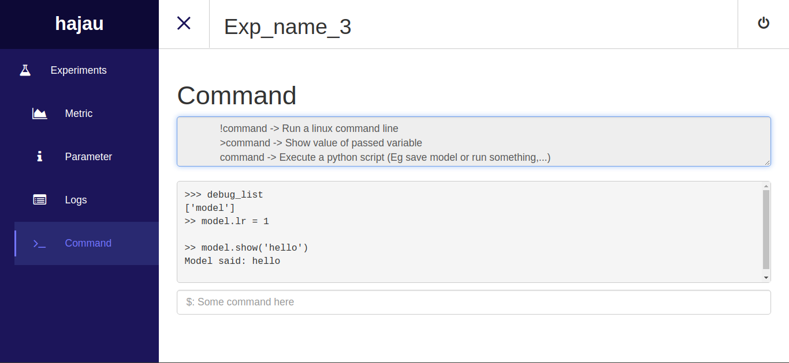

# Monitor

Homepage: [https://hajaulee.github.io/monitor/](https://hajaulee.github.io/monitor/)

The simple monitor using Google Firebase to monitor and control deep learning model training progress or something else,
This is cloud-based monitor, use can access me from everywhere (has internet connection).

Use this monitor, you can:

* Easy to install and using
* View metric in real-time chart 
* Track parameter or config used in experiment
* Track real-time log during training progress
* Control and interact to experiment even though it is running

Accese [homepage](https://hajaulee.github.io/monitor/) to monitor



# Installation

install via `pip`

```
$ pip install git+https://github.com/hajaulee/monitor
```

or clone this repository

```
$ git clone https://github.com/hajaulee/monitor
$ cd dl
$ python setup.py install
```

# Usage

### Login

Login with any username and password

```
$ dlm <username> <password>
```

### Using in your project

1. Import

```python 
from hajau import Experiment
```

2. Init

_Initialize experiment with name_

```python 
exp = Experment(name='GAN Training')
```

3. Log some parameters

_Add model meta parameters or traing config etc_

```python 
exp.param('batch_size', 32)
```

4. Log some metrics

_Add and update some metric during training progress_

```python 
exp.metric('loss', 0.2)
```

5. Log somethings

_Log something such as training status during training progress_

```python 
exp.log('Hello world')
```

6. Debug

_Add a object to `exp.debug_list`, for you can control it via monitor page_

```python 
exp.debug(model=GAN_model)
```


