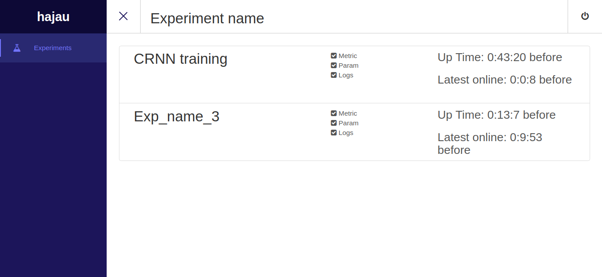
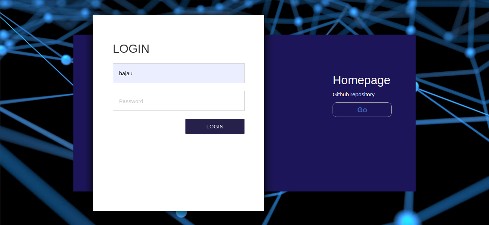
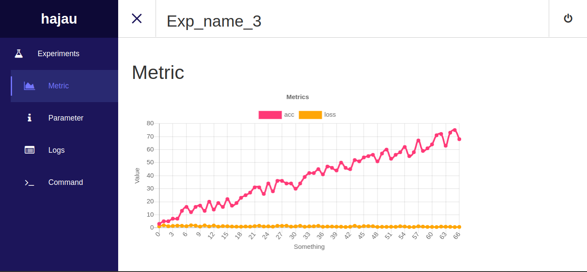
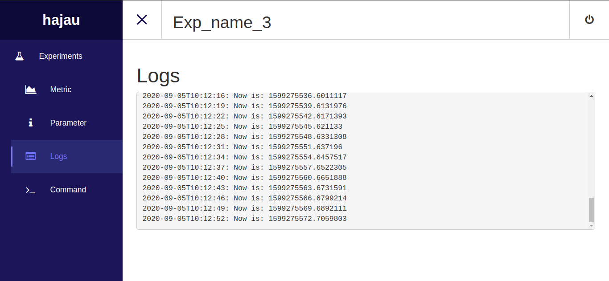

# Monitor

Homepage: [https://hajaulee.github.io/monitor/](https://hajaulee.github.io/monitor/)

The simple monitor using Google Firebase to monitor and control deep learning model training progress or something else,
This is cloud-based monitor, so use can access me from everywhere (has internet connection).

Use this monitor, you can:

* Easy to install and using
* View metric in real-time chart 
* Track parameter or config used in experiment
* Track real-time log during training progress
* Control and interact to experiment even though it is running

Accese [homepage](https://hajaulee.github.io/monitor/) to monitor



# Installation

install via `pip`

```
$ pip install git+https://github.com/hajaulee/monitor
```

or clone this repository

```
$ git clone https://github.com/hajaulee/monitor
$ cd dl
$ python setup.py install
```

# Usage

### Signup

Signup with any username and password

```
$ dlm <username> <password>
```

### Using in your project

1. Import

```python 
from hajau import Experiment
```

2. Init

_Initialize experiment with name_

```python 
exp = Experment(name='GAN Training')
```

3. Log some parameters

_Add model meta parameters or traing config etc_

```python 
exp.param('batch_size', 32)
```

4. Log some metrics

_Add and update some metric during training progress_

```python 
exp.metric('loss', 0.2)
```

5. Log somethings

_Log something such as training status during training progress_

```python 
exp.log('Hello world')
```

6. Debug

_Add a object to `debug_list`, for you can control it via monitor page, you can view example and snapshot to detail_

```python 
exp.debug(model=GAN_model)
```

# Example

```python

from hajau import Experiment


class Model(object):

	def __init__(self):
		self.lr = 0

	def show(self, c): # Can be called from monitor if you want
		print('Model said:', c)


test = Experiment('Exp_name_3')
test.param('newa', dict({'c': 1, 'd': 6}))
test.param('newb', dict({'c': 1, 'd': 6}))
test.param('newc', dict({'c': 1, 'd': 6}))


model = Model()

test.debug(model=model)

import time
import random
i = 0
while True:
	test.log('Now is: ' + str(time.time()))
	test.metric('acc', min(i, 90) + random.randint(0, 10))
	test.metric('loss', max(0, 1 - 0.01 * i) + random.random())
	time.sleep(3)
	print('Epoch {}, lr: {}'.format(i, model.lr))
	i+=1
print("Exit loop")    
test.close()

```

# Snapeshot

### Login page

Login with username and password you created via cli


### Experiments list


### Metric

Graph of metrics log


### Logs



### Command

You can check, or execute method of objects passed to `exp.debug`, and run linux command
